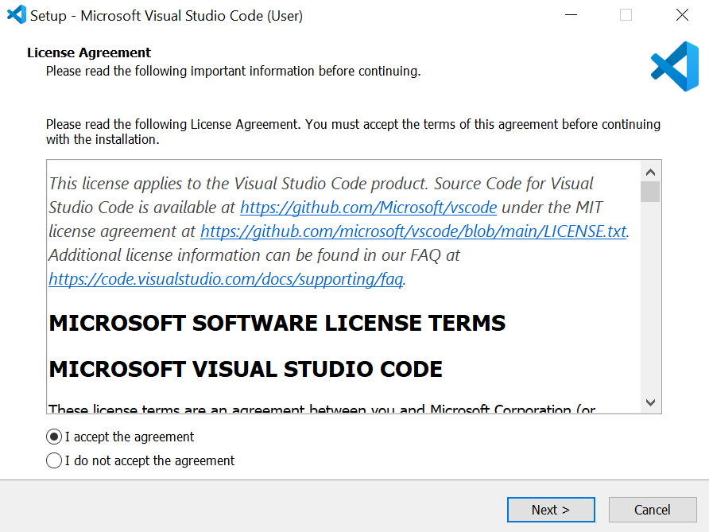
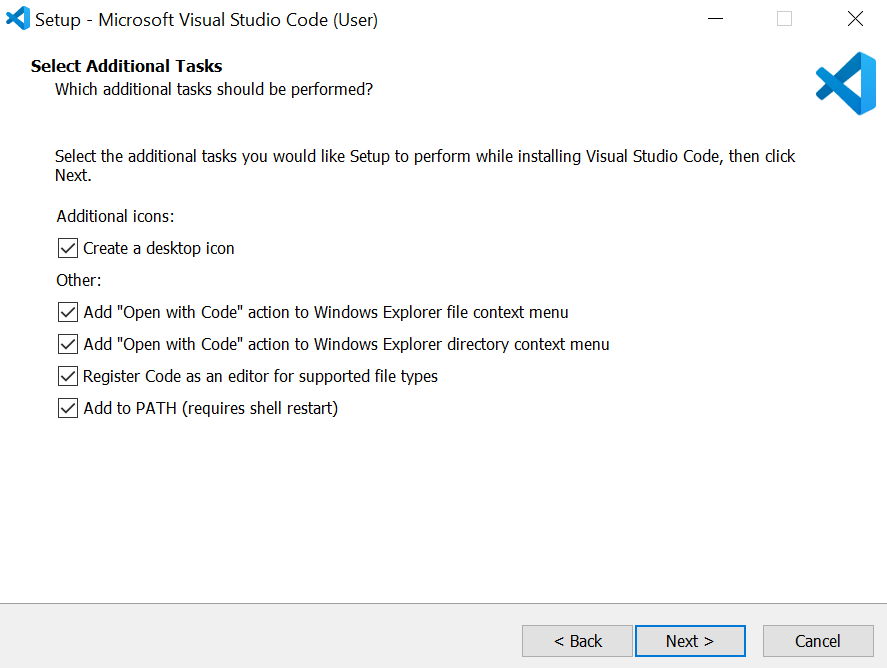

# How to run c++ code locally

  **Objective:**  

  *   To setup your development environment.
  *	  To compile and run an cpp parallel program.

  **Software:**  

  *   MinGW Installation Manager or MinGW-w64
  *   Visual Studio code

## Installing g++ compiler

**In this tutorial, I explain two ways to install g++ compiler:**

*   **MinGW** (Minimalist GUN for Windows, originally called mingw32) is a native Windows port of the GNU Compiler Collection (GCC) that provides header files and free distributable import libraries for creating native Windows applications. 
Note that all the programs produced under MinGW are 32-bit executables, but they can be used in 32-bit and 64-bit versions of Windows.

*   **MinGW-w64** is an advancement of the original MinGW project. It was forked in 2007 in order to provide support for 64 bits and new APIs. 
Note that MinGW-w64 supports binaries native to Windows 64-bit and 32-bit operating systems.

### Installing g++ compiler use MinGW Installation Manager

1.  Visit the website **[MinGW](https://sourceforge.net/projects/mingw/)** and click on Download.
2.  Once the file is downloaded. Open the `mingw-get-setup.exe` file then click on [**Install**] 
    <figure markdown="span">
    { width="600" }
    </figure>
3.  I am going to install MinGW under `C:` directory, click on [**continue**] 
    <figure markdown="span">
    { width="600" }
    </figure>
4.  Wait MinGW to install then click on [**continue**] 
    <figure markdown="span">
    { width="600" }
    </figure>
5.	In `MinGW Installation Manager` select `mingw32-base-bin` by clicking on the square control beside the package name. You should see as below:  
    <figure markdown="span">
    { width="600" }
    </figure>
6.	Also, you should select all the following package as below: 
    <figure markdown="span">
    { width="600" }
    </figure>
7.	On the menu bar, select `Installation` :material-arrow-right: `Apply Changes` as shown below: 
    <figure markdown="span">
    { width="600" }
    </figure>
8.	Click on the `Apply` as shown below:
    <figure markdown="span">
     { width="600" }
    </figure>
9.	Finally, After the installation finish click on `Close`
10. After that, go to the installation directory [*in my case* `C:\MinGW\bin`] and copy the directory of the bin folder as shown below: 
    <figure markdown="span">
    { width="600" }
    </figure>
11. Go to the setting and write `env` on the search bar, select `Edit environment variables for your account` as shown below: 
    <figure markdown="span">
    { width="600" }
    </figure>
12.	Select `path` and click on `Edit` as shown below: 
    <figure markdown="span">
    { width="600" }
    </figure>
13. Click on `New` to add your copied MinGW path [ *in my case* `C:\MinGW\bin` ] 
    <figure markdown="span">
    { width="600" }
    </figure>
14.	Finally click on OK :material-arrow-right: OK

### Installing g++ compiler use MinGW-w64

**[MinGW-w64](https://www.mingw-w64.org/downloads)** comes in three flavors for Windows: GitHub, WinLibs, or MSYS2. Here we will use the **WinLibs** flavor (a standalone build of GCC and MinGW-w64 for Windows).

1. Visit the website **[WinLibs](https://winlibs.com/)**. Here we will download release versions of **UCRT** (Univarsal C Runtime) with the threading library POSIX threads/pthread.h. Under UCRT, select the GCC version with POSIX threads. For example, click on Win32 (without LLVM/Clang/LLD/LLDB) or Win64 (without LLVM/Clang/LLD/LLDB) based on your system as shown below, or download GCC 14.2.0 (with POSIX threads) directly from here: **[Win32](https://github.com/brechtsanders/winlibs_mingw/releases/download/14.2.0posix-18.1.8-12.0.0-ucrt-r1/winlibs-i686-posix-dwarf-gcc-14.2.0-mingw-w64ucrt-12.0.0-r1.zip)** or **[Win64](https://github.com/brechtsanders/winlibs_mingw/releases/download/14.2.0posix-18.1.8-12.0.0-ucrt-r1/winlibs-x86_64-posix-seh-gcc-14.2.0-mingw-w64ucrt-12.0.0-r1.zip)**<figure markdown="span">{ width="600" }</figure>
2. Extract the **Winlibs** downloaded file to the `C:` directory, as shown below. <figure markdown="span">{ width="600" }</figure>
3. Copy the directory of the bin folder `C:\mingw64\bin` in my case, then add it to the environment variable path, following the same steps from 11 to 14 on [**Installing g++ compiler, use MinGW Installation Manager**](index.md/#installing-g-compiler-use-mingw-installation-manager)

## Installing Visual Studio Code

1. Visit the website **[VS code](https://code.visualstudio.com/Download)** Click on `Windows` to download VS code for Windows, as shown below 
    <figure markdown="span">
    { width="600" }
    </figure>
2. After the download finished open the `VSCodeUserSetup` executable file, when it open select `I accept the agreement` then click on `Next` 
    <figure markdown="span">
    { width="600" }
    </figure>
3.	Select all the option as seen below 
    <figure markdown="span">
    { width="600" }
    </figure>

4.	Finally we are ready to install the VS code, click on `install` and wait untail the setup finish
5.	On the Vs code, on the left-hand side, click on `extension` then in the search bar, write `C++` select `C/C++` and click on `Install` as shown below 
    <figure markdown="span">
    { width="600" }
    </figure>
6.	Close `Vs code`

## Running C++ parallel code on VS code

1.	Right click on the Windows button `or press windows + x` then select `Windows PowerShell Admin` as shown below 
    <figure markdown="span">
    { width="300" }
    </figure>
3.	Navigate to `D:` directory by write `cd d:` as shown below 
    <figure markdown="span">
    { width="600" }
    </figure>
4.	Then make directory named `Parallel-codes` [`mkdir Parallel-codes`] as shown below 
    <figure markdown="span">
    { width="600" }
    </figure>
5.	Then navigate to the directory 
    <figure markdown="span">  
    { width="600" }
    </figure>
6.	Write `code .` to open VS code on the `d:\Parallel-codes` directory
    <figure markdown="span">  
    { width="600" }
    </figure>
7.	After `VS code` open, create new file name it `fibo.cpp` and write Fibonacci code in the end of **[Lab(1)](https://khalid-elbadawi.github.io/C425/labs/lab01/)** save `fibo.cpp`,then on the top bar select on `…` :material-arrow-right: Terminal :material-arrow-right: New Terminal. As shown below 
    <figure markdown="span">  
    { width="600" }
    </figure>
8. Before to add `pthread.h` header file you need to install `pthreads` library also known as `POSIX` threads, which is provides a way to create and manage threads in multi-threaded program. To install the library use `mingw-get` command and write `mingw-get install pthreads` on the terminal 
Skip this step if you are installing g++ compiler use MinGW-w64
    <figure markdown="span">  
    { width="600" }
    </figure>
9. Compile the `fibo.cpp` program. Write this command: `g++ -o fibo -pthread fibo.cpp` on the terminal. 
**Let us explain the command in detail:** 
  `g++`: GUN Compiler Collection for c++ 
  `-o fibo`: `-o` flag to create the output file named `fibo` 
  `-pthread` flag: tell the compiler to link with the `pthread` library 
  `fibo.cpp`: the name of the program 
  **Note that:** if you want to use `openMP` on your program [`omp.h` header file]. You need to add [`-fopenmp`] flag [`g++ -o out –fopenmp program.cpp`] to compile the program.
    <figure markdown="span">  
    { width="600" }
    </figure>
10.	Finally write `./fibo` on the terminal to run `fibo` program 
    <figure markdown="span">  
    { width="600" }
    </figure>